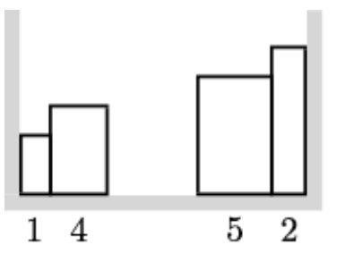

## 1. Книжная полка стажера

Эдуард приехал в общежитие Y&&Y и сейчас занимается распаковкой вещей из огромного числа коробок. Как и другие стажеры, он считает, что даже на книжной полке необходим порядок и книги следует размещать в порядке возрастания высоты (т.е. на левой стороне полки должна стоять самая низкая книга, а при просмотре слева направо высота книг должна увеличиваться или не изменяться).

Эдуард очень суеверный, поэтому он берёт книги из коробки по одной и сразу ставит их на полку, не двигая другие книги. Он может поставить книгу около левой стенки полки, если там пока нет книги, либо справа вплотную к книгам, касающимся левой стенки. Аналогично, он может разместить книгу прямо у правой стенки полки или же приставить книгу слева к стоящим в правой стороне книгам, если место непосредственно у правой стенки занято. Эдуард решил, что некоторые книги можно не ставить на полку, а сразу убрать в шкаф. Пусть пылятся!

Стажер знает, в каком порядке он будет доставать книги из коробки. Помогите ему поставить на полку как можно больше книг. Полка достаточно широкая, чтобы все книги могли на ней поместиться по ширине. Но помните про порядок на полке и суеверия Эдуарда!

## Формат ввода

В первой строке входных данных записано единственное целое число n (1≤n≤100) − количество книг в коробке.

Во второй строке записаны n натуральных чисел. i-е число задает высоту книги, которую достанет i-й по счету из коробки стажер. 

Все числа во входном файле не превосходят 100.

## Формат вывода

В единственной строке выведите наибольшее количество книг, которое можно поставить на полку.

## Примечание
В первом примере одной из возможных последовательностей книг будет:

<table>
 <tr>
    <td>Ограничение времени</td>
    <td>2 с</td>
 </tr>
 <tr>
    <td>Ограничение памяти</td>
    <td>256.0Mb</td>
 </tr>
</table>

### Пример 1

Ввод

    5
    2 5 1 3 4
    

Вывод

    4

### Пример 2

Ввод

    7
    1 8 3 6 4 7 2
    

Вывод

    5

### Пример 3

Ввод

    10
    1 6 2 7 3 8 4 9 5 10
    

Вывод

    6