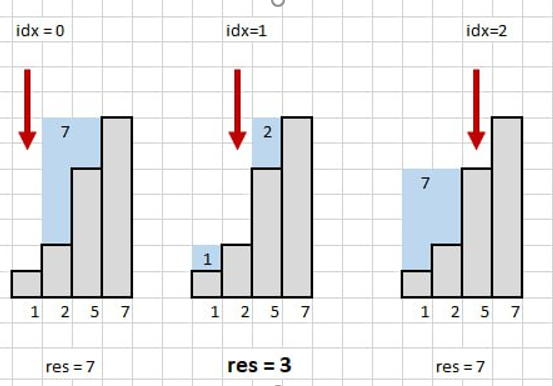

# 1. Нужно больше конфет!

## Алгоритм:
    1. Сортируем банки: Это позволяет быстрее определить префиксы и суффиксы.
    2. Вычисляем добавки через префиксы и суффиксы:
        Для каждого возможного второго значения (candies[i]) считаем добавки для меньших и больших значений.
    3. Общая идея:
        Банки с меньшим количеством конфет должны стать равными candies[i].
        Банки с большим количеством конфет должны стать равными максимальному значению.