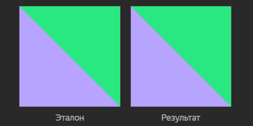

# 5. Китти Мяурхол. Первые шаги

Китти Мяурхол решил стать художником. И не простым, а на CSS.

Взрослые художники рассказали юному дарованию, что для начала стоит научиться работать с примитивами. Как только Китти освоит рисование простых геометрических фигур, дальше из них можно будет собирать почти что угодно в полноценные иллюстрации.

Прямоугольники Китти уже рисовал и много раз. Поэтому своим первым примитивом выбрал треугольник.

Тебе нужно сверстать картинку 512 на 512 пикселей при помощи HTML и CSS.

Примечание
Вёрстка должна в точности соответствовать изображению.

Для рисования использовались следующие цвета: #B6A4FF, #2AE881.

<table>
 <tr>
    <td>Ограничение времени</td>
    <td>60 c</td>
 </tr>
 <tr>
    <td>Ограничение памяти</td>
    <td>1 Gb</td>
 </tr>
  <tr>
    <td>Ограничение проверки</td>
    <td>Нельзя использовать скрипты и изображения (JPG, PNG, SVG и аналоги).</td>
 </tr>
</table>

## Результат

