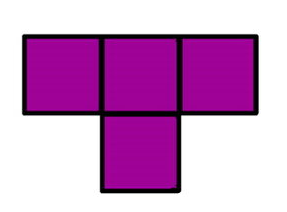

# 1. Тетрамино

На шахматном поле 8×8 некоторые клетки пустые, а некоторые заняты фигурами.

Определите количество способов разместить тетрамино на этом поле, чтобы фигура занимала целиком четыре свободные клетки.

В задаче мы рассматриваем тетрамино только одного типа.

## Формат ввода

Входные данные состоят из 8 строк по 8 символов. Пустая клетка задается точкой ., а занятая звездочкой *.

## Формат вывода

Выведите количество способов разместить тетрамино на поле.

<table>
 <tr>
    <td>Ограничение времени</td>
    <td>1&nbsp;секунда</td>
 </tr>
 <tr>
    <td>Ограничение памяти</td>
    <td>256.0Mb</td>
 </tr>
</table>

### Пример 1

Ввод

    ....****
    ....****
    ....****
    ....****
    ****....
    ****....
    ****....
    ****....
    

Вывод

    48    

### Пример 2

Ввод

    ********
    ********
    ********
    ********
    ********
    ********
    ********
    ********
    

Вывод

    0
    
### Пример 3

Ввод

    ********
    ********
    ********
    ********
    ********
    ********
    ******..
    ........
    

Вывод

    1

